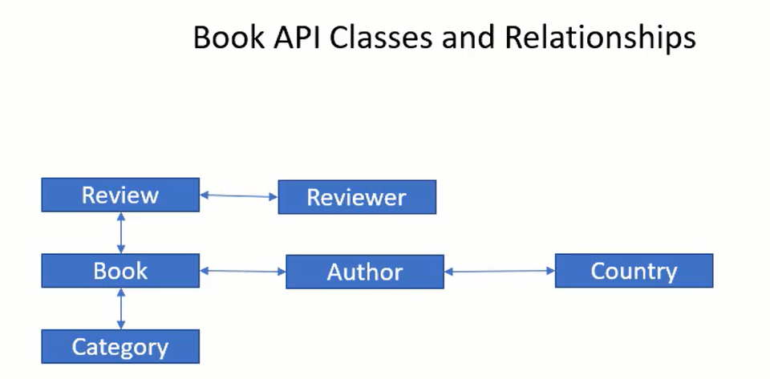
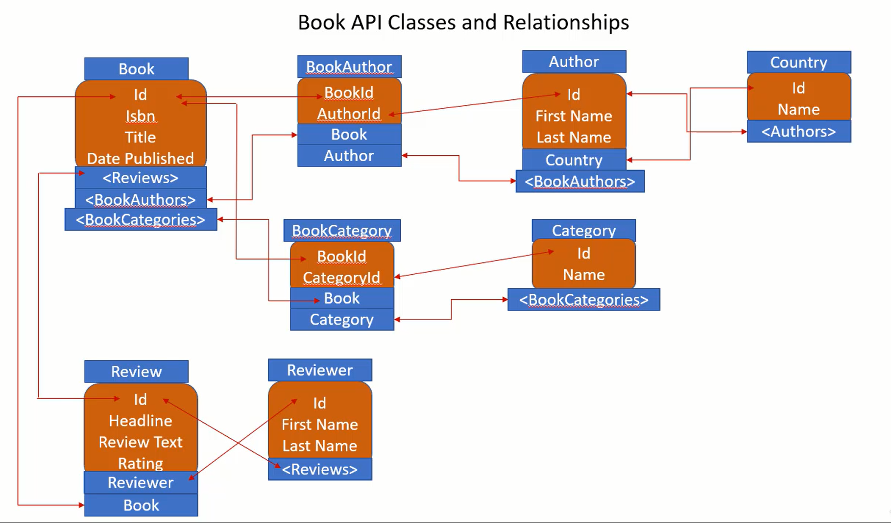

>### Books Api

> Techologies Used
1) Dotnet core Version 3.0
2) Visual Studio Code.
3) Dotnet core cli
4) Docker mysql-server

#### Pattern Used

Pattern :  Repository Pattern

# Books Api Classes and relatioships

# Relationships

